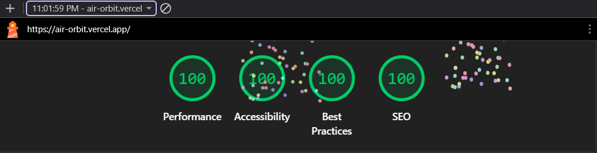

# AirOrbit — Flight Management PWA

**Your journey, our mission.**

Responsive flight search, interactive seat maps, booking, reschedule/cancel, and a 3D route explorer. Built for the internship assignment (Next.js 14, Supabase, Zustand, Tailwind, PWA).

## Features

- **Search & book** — origin, destination, date, multi-passenger, class pricing
- **Seat map** — economy / business / first, realtime availability, tooltips
- **My bookings** — cancel (2h DB rule), reschedule, offline cache
- **Explore** — Earth globe, route arcs, live flights from DB
- **Boarding pass** — QR + PDF download on confirmation
- **PWA** — install prompt, offline page, service worker (production build)

## Deployment

- **Production (Vercel):** https://air-orbit.vercel.app


## Quick start (local)

```bash
npm install
cp .env.example .env.local
# Fill Supabase keys in .env.local
npm run dev
```

Open [http://localhost:3000](http://localhost:3000).

### Environment variables

| Variable | Description |
|----------|-------------|
| `NEXT_PUBLIC_SUPABASE_URL` | Supabase project URL |
| `NEXT_PUBLIC_SUPABASE_ANON_KEY` | Public anon key |
| `NEXT_PUBLIC_SITE_URL` | `http://localhost:3000` or production URL |
| `SUPABASE_SERVICE_ROLE_KEY` | Server-only; never commit real value |


Optional: seed more calendar flights:

```bash
node scripts/seed-calendar-flights.mjs
```

## Zustand stores

| Store | Persist key | Persisted fields |
|-------|-------------|------------------|
| `useFlightStore` | `flight-store` | Search, flight, seats, step, passengers (**passport excluded**) |
| `useUserStore` | `user-store` | Session tokens + **cached bookings** (offline) |
| `useGlobeStore` | — | Session only |

`resetAll()` on logout / cancel clears flight, user, and globe state.

## Supabase architecture

- **RLS** on all tables; users access only their bookings
- **RPC:** `reserve_seat`, `cancel_booking`, `get_routes_between`
- **Realtime:** `seats` table for live seat map
- **Anon read** on flights/seats for search (migration `006`)


## PWA / Lighthouse

Production build enables `@ducanh2912/next-pwa`. After deploy:

### Lighthouse Score

| Performance | Accessibility | Best Practices | SEO |
|-------------|---------------|----------------|-----|
| 100 | 100 | 100 | 100 |

### Lighthouse Screenshot




## Project structure

```
app/              # App Router pages & API routes
components/       # UI, seats, globe, bookings
lib/              # Supabase, stores, errors, utils
supabase/migrations/
public/           # logo, icons, manifest, textures
docs/             # Assignment checklist, email setup
```


## License

MIT — internship submission.
